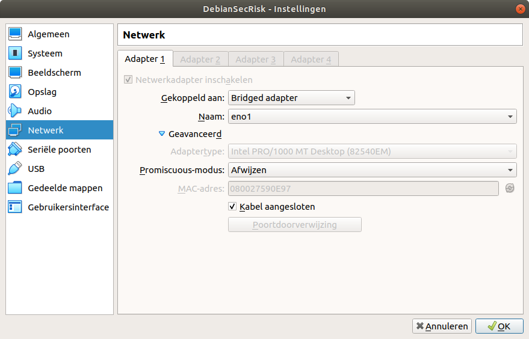

# De Debian Virtuele Machine 

De virtuele machine is te vinden op BlackBoard. De docent geeft je instructies waar deze te vinden is. Ook dan
krijg je de toegangsgegevens (username/password).

# Backup maken
Je kunt aan de slag met het beveiligen van je machine. Soms levert dit een onwerkbare situatie op die niet eenvoudig
te herstellen is. Daarom is het verstandig om regelmatig een kloon te maken van je VM. Dat kan eenvoudig via 
Virtual Box of door het **disk** bestand te kopieren.

  1. Log uit en stop je VM
  2. Open het menu van de virtual box --> Bestand --> Sluiten.
  3. Kies voor 'Het shutdown-signaal sturen'.
  
De machine wordt nu netjes uitgezet. 

Ga terug naar de `Oracle VM VirtualBox` en zoek je virtuele machine op. We gaan nu de kloon aanmaken:
  1. Menu-->Machine-->Kloon
  2. Kies een map
  3. Start het proces met 'Volgende'. 
  4. Kies een map
  5. Gebruik 'Volledige kloon'
  
Nadat het kloon-proces klaar is verschijnt er een nieuwe VM in je lijst met VM's. 
  

## Debian bijwerken naar laatste updates.
Hoewel je net waarschijnlijk het laatste image van Debian hebt gedownload, zijn er zeer waarschijnlijk al weer updates
verschenen. Deze kun je met onderstaande commando's bijwerken. Doe dit voordat je verder gaat. Zorg dat je bent ingelogd
als `root`! 

```bash
root@debian: ~# apt update
```
Dit commando kijkt of er updates zijn. Zo ja, dan installeer je deze met onderstaande commando:
```bash
root@debian:~# apt upgrade
```

Later willen we onze eigen user (in mijn geval `martin`) mogelijk ook commando's uit laten voeren met verhoogde rechten
(*elevated rights*). Daarvoor gebruik je dan het commando `sudo` . We gaan dit commando nu eerst installeren en kennen
vervolgens de gebruiker `martin` toe aan de groep met gebruikers die gebruik mag maken van dit commando.


```bash
root@debian:~# apt install sudo
root@debian:~# adduser martin sudo
Adding user `martin' to group `sudo' ...
Adding user martin to group sudo
Done.
root@debian:~# 
```

Later kun je dan je rechten tijdelijk verhogen of een *elevated prompt* openen. De eerste keer ziet dat er zo uit:
(login via SSH)
```bash
martin@debian:~$ sudo -i

We trust you have received the usual lecture from the local System
Administrator. It usually boils down to these three things:

    #1) Respect the privacy of others.
    #2) Think before you type.
    #3) With great power comes great responsibility.
[sudo] password for martin: 
root@debian: ~# 
root@debian: ~# who am i
martin   pts/0        2021-01-09 14:33 (192.168.123.11)
root@debian:~# 
```

# Backup maken
Nu je machine in de basis klaar is én voorzien van de laatste updates, is het verstandig om nogmaals een kloon te maken van je VM. Dat kan eenvoudig via Virtual Box of door het **disk** bestand te kopieren.

### SSH Toegang
Voor het volgen van de andere tutorials is het handig dat je op afstand kunt werken op je Virtuele Machine. Dat doen
we dan via het commando SSH. In zowel Linux (Ubuntu, Debian, Kali) en Windows 10 is dit óf standaard aanwezig of 
simpel te installeren.

**Let op**: de `root` user mag niet inloggen bij de standaard configuratie van de SSH-daemon. Maak daarom altijd eerst 
een andere gebruiker aan en gebruik deze om in te loggen. Heb je toch `root`-access nodig, voeg je nieuwe 
gebruiker dan toe aan de `sudo` groep (zie elders in deze handleidingen).

Om te zorgen dat de VM op afstand de VM via het netwerk kunnen bereiken moet je zorgen dat je VM ook een IP-adres 
krijgt dat de router van het netwerk ook kent. Standaard is dat niet zo binnen Virtual Box. 

We gaan in onderstaande eenvoudige scenario er van uit dat je **thuis** via een router werkt. Open de netwerkinstellingen 
de VM (dat kan via Virtual Box óf terwijl je VM gewoon draait via het host-menu). Voor een uitgebreide handleiding
om je netwerk goed in te stellen met Virtual Box zie [Netwerk installen](../Netwerk/README.md).



Verander de instelling bij 'Gekoppeld aan' in 'Bridged Adapter'. Sla de instellingen op met 'OK' en ga naar je VM. 
Zorg dat je ingelogd bent als `root` en voer onderstaande commando's uit:

```bash
root@debian:~# dhclient
root@debian:~# ip addr
1: lo: <LOOPBACK,UP,LOWER_UP> mtu 65536 qdisc noqueue state UNKNOWN group default qlen 1000
    link/loopback 00:00:00:00:00:00 brd 00:00:00:00:00:00
    inet 127.0.0.1/8 scope host lo
       valid_lft forever preferred_lft forever
    inet6 ::1/128 scope host 
       valid_lft forever preferred_lft forever
2: enp0s3: <BROADCAST,MULTICAST,UP,LOWER_UP> mtu 1500 qdisc pfifo_fast state UP group default qlen 1000
    link/ether 08:00:27:59:0e:97 brd ff:ff:ff:ff:ff:ff
    inet 10.0.2.15/24 brd 10.0.2.255 scope global dynamic enp0s3
       valid_lft 84971sec preferred_lft 84971sec
    inet 192.168.123.172/24 brd 192.168.123.255 scope global dynamic enp0s3
       valid_lft 85509sec preferred_lft 85509sec
    inet6 fe80::a00:27ff:fe59:e97/64 scope link 
       valid_lft forever preferred_lft forever
root@debian:~# 
```

Je ziet nu als het goed is een IP-adres dat bruikbaar is in je eigen netwerk bij enp0s3 (in mijn geval `192.168.123.172`). 

Start nu een ssh client als volgt:
```bash
ssh martin@192.168.123.172
The authenticity of host '192.168.123.172 (192.168.123.172)' can't be established.
ECDSA key fingerprint is SHA256:8jGsPFtJssdB5mHKIhC6Xe6NFmA2DTVX93H9UZ64B24.
Are you sure you want to continue connecting (yes/no)? yes
Warning: Permanently added '192.168.123.172' (ECDSA) to the list of known hosts.
martin@192.168.123.172's password: 
```

**Let op**: de eerste keer dat je verbinding maakt met zo'n computer via SSH worden sleutels uitgewisseld. De `fingerprint`
daarvan wordt opgenomen in een file (`known_hosts`) als je bevestigd dat deze correct is. Zorg dat je dus `yes` antwoord
op deze vraag.


Je bent nu verbonden met je VM 'op afstand' zodat ook vaak kopiëren/plakken werkt vanuit de rest van de tutorial.
